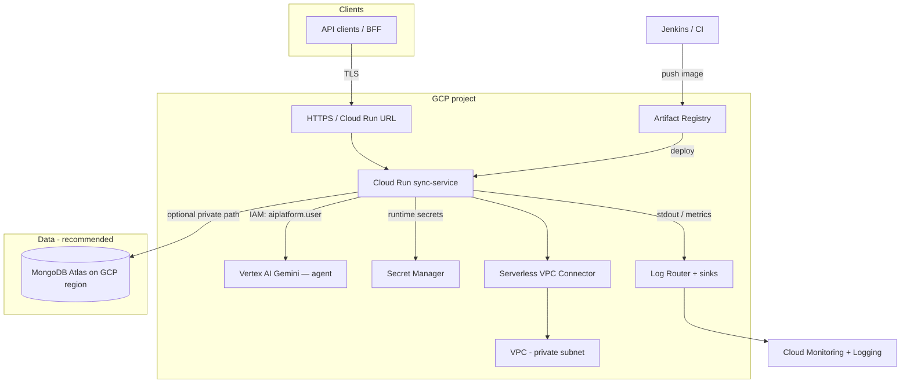

# Part 2 — Infrastructure Design (GCP, Terraform)

## Summary

This proposal runs **sync-service** on **Cloud Run** (autoscaling, low ops overhead), places it in a **custom VPC** for network control, uses **Google Secret Manager** for credentials, **Cloud IAM** for least-privilege access, and **MongoDB Atlas** (or self-managed MongoDB on GCE) for data — with **Cloud Logging / Cloud Monitoring** as the primary observability stack. Infrastructure as code lives under [`terraform/`](../terraform/).

**Advanced pieces (in repo Terraform):** **Cloud Router + Cloud NAT** (optional) so traffic leaving Cloud Run through the **Serverless VPC Access** connector can use **predictable outbound IP addresses** (useful for **MongoDB Atlas** IP allowlists when egress is set to *all traffic* through the VPC). **Uptime checks** in Cloud Monitoring call **`/actuator/health` over HTTPS** on the public Cloud Run URL. A **sample `sync-service` API** in [`app/`](../app/) (FastAPI) exposes **`/actuator/health`**, **`/ready`**, and **`/api/v1/info`**; build and push the image to Artifact Registry, then set `container_image` to deploy it instead of the public sample.

---

## Architecture diagram

For **org-internal only** access, add **Internal HTTP(S) Load Balancer** + **Serverless NEG** in front of Cloud Run and restrict with **IAP** or **VPC** + firewall rules (details in implementation notes).

---

## 1. Compute: Cloud Run (vs GKE vs Compute Engine)

| Option | When to use | For this assignment |
|--------|-------------|---------------------|
| **Cloud Run** | Stateless HTTP, scale-to-zero, per-request billing | **Chosen:** fits Spring Boot behind HTTP; built-in autoscaling; minimal ops; cost-friendly at startup. |
| **GKE (Standard / Autopilot)** | Complex networking, long-lived workers, custom CRDs, multi-tenant cluster | Use if the team standardizes on Kubernetes for all services or needs DaemonSets, etc. |
| **Compute Engine (MIG)** | “VMs in assignment brief,” legacy, full OS control | Higher ops; you manage OS patches and autoscaling; good if compliance mandates VMs *only*. |

**Justification for Cloud Run:** The service is a **typical stateless API**; Cloud Run provides **autoscaling** (including to zero in non-prod), **HTTPS termination**, and **revisions** for rollback, while keeping the **TCO and run cost** low for a startup. If CloudEagle mandates VMs, the same Terraform can be extended with a **MIG** + **load balancer** pattern; the **network, IAM, and secrets** model stays similar.

---

## 2. MongoDB hosting

| Approach | Pros | Cons |
|----------|------|------|
| **MongoDB Atlas (same GCP region)** | Managed upgrades, backup, monitoring; VPC peering / PrivateLink style connectivity | Ongoing cost; org account needed |
| **Self-managed on GCE** (or GKE StatefulSet) | Full control, potentially lower at high scale | You operate backups, HA, and patches |

**Recommendation:** **Atlas M10+** (or M0/M2 for dev) with **IP allowlist** and/or **Private Endpoint / VPC peering** to the GCP VPC, depending on security requirements. The Spring `MONGODB_URI` is stored in **Secret Manager**; only the Cloud Run service account can read it.

*Terraform:* MongoDB Atlas can be added via the [MongoDB Atlas Terraform provider](https://registry.terraform.io/providers/mongodb/mongodbatlas/latest/docs) in a follow-up, or the URI can be **manually** created in Atlas and **imported** as a `google_secret_manager_secret` value. This repo documents the pattern; Atlas cluster creation is optional to avoid two providers for a minimal first pass.

---

## 3. Networking (VPC, ingress)

- **Custom VPC** with **regional subnet(s)** for the **Serverless VPC Access connector** (and optional private endpoints).  
- **Cloud Run** receives **public HTTPS** by default; restrict with **Cloud IAM** (authenticated invokers) and/or **VPC + ILB** for internal-only APIs.  
- **Firewall:** default deny, allow only connector → MongoDB/Atlas peering CIDR; no SSH from 0.0.0.0/0.  
- **Egress:** Cloud Run can use **VPC connector** to reach private MongoDB; control internet egress with **Serverless VPC Access** + **Cloud NAT** if all outbound should use fixed IPs (Atlas allowlist).

---

## 4. Secrets & IAM

- **Per-environment GCP projects** (recommended): `ce-sync-qa`, `ce-sync-staging`, `ce-sync-prod` — blasts-radius reduction.  
- **Service account per app env:** e.g. `cloudrun-sync@...` with:  
  - `secretmanager.secretAccessor` on the MongoDB secret;  
  - no broad `Editor` on the project.  
- **CI/CD (Jenkins / Cloud Build):** short-lived tokens via **Workload Identity Federation** to GCP, or a dedicated service account with **only** Artifact Registry + Cloud Run in the target project.  
- **No secrets in Terraform state:** store secret *versions* in Secret Manager; use `google_secret_manager_secret` + `google_secret_manager_secret_version` for placeholder version or `ignore_changes` and set values out-of-band.

---

## 5. Logging & monitoring

- **Cloud Logging:** automatic stdout/stderr from Cloud Run; use **log-based metrics** (e.g. 5xx rate) for SLOs.  
- **Cloud Monitoring:** CPU, request latency, instance count, optional **uptime checks** and **alerting policies** (Slack/PagerDuty webhooks).  
- **Traces (optional):** **Cloud Trace** with OpenTelemetry in Spring Boot for request latency.  
- **Error reporting:** integrate with **Error Reporting** for uncaught stack traces.

**Cost control:** set **log retention** (e.g. 30 days), limit **custom metrics** cardinality, and use **SLO alerts** on a small set of signals rather than “alert on everything.”

---

## 6. Autoscaling, cost, security (startup constraints)

- **Cloud Run:** set **min instances** 0 in QA; **min 1+** in prod if cold start is unacceptable. **Max instances** cap prevents runaway cost.  
- **MongoDB:** right-size Atlas tier; use **read preferences** to offload read traffic if the API allows.  
- **Commitments / CUDs:** only after traffic is stable.  

---

## 7. Terraform in this repository

The [`terraform/`](../terraform/) directory provisions: enabled APIs, VPC + subnet, Serverless VPC connector, Artifact Registry, Secret Manager secret placeholder, Cloud Run service (pinned by image at apply time), and IAM for the Cloud Run service account. **Replace** `project_id` and `mongo_secret_version` (or set secrets manually) before `terraform apply`.

---

## Deliverables checklist (Part 2)

- [x] Architecture diagram (Mermaid, renders on GitHub)  
- [x] Written explanation of key choices (this file)  
- [x] Terraform project for baseline infrastructure  
